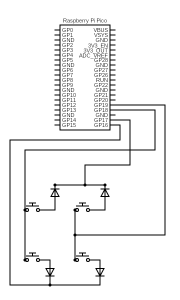

# Makro-pad based on Raspberry Pi Pico, MicroPython and the KMK Library

## Hardware
Used hardware for this build:
- Raspberry Pi Pico (first series that were sold, 1 out of 10 from a spindle)
- 4 push-buttons (random order via eBay)
- 4 diodes, 1N4007 (suitable for this purpose)
- case I bought at Radioshack in New Orleans a couple of years ago
- 1 printed mount for the Raspberry Pi [Pico Mount B.stl](https://www.printables.com/model/250703-pi-pico-mount) on a tesa strip
- 4 mm drill-bit
- stepbit for drilling up to 13,5 mm for the pushbuttons
- file for squaring the hole for the USB cable

### Schematic for the keypad



This schematic represents a 2x2 custom keyboard layout, where each button is connected to a specific row and column. The diodes are used to prevent ghosting and ensure accurate key detection. The 3 pins on the Raspberry Pi Pico are used to scan the rows and columns of the keyboard matrix.

Please note that this is a simplified representation and the actual implementation may vary depending on the specific hardware and wiring requirements. It is recommended to refer to the official documentation or consult relevant resources for detailed instructions on building and wiring custom keyboards using the Raspberry Pi Pico.


### Raspberry Pi Pico

The Raspberry Pi Pico is a microcontroller board developed by the Raspberry Pi Foundation. It features the RP2040 microcontroller chip, which is designed specifically for microcontroller applications. The Pico board provides a low-cost and versatile platform for building various embedded systems and projects.

Key Features of Raspberry Pi Pico:
- RP2040 Microcontroller: The Pico board is powered by the RP2040 microcontroller chip, which offers a dual-core ARM Cortex-M0+ processor running at 133 MHz, 264KB of SRAM, and a wide range of peripherals.
- GPIO Pins: The board has 26 GPIO pins, which can be used for digital input/output, PWM, SPI, I2C, UART, and other communication protocols.
- Programmable: The Pico board can be programmed using various programming languages, including MicroPython, C/C++, and CircuitPython.
- USB Connectivity: It has a USB port for power supply, programming, and communication with other devices.
- Low Power Consumption: The Pico board is designed to be power-efficient, making it suitable for battery-powered applications.

## Software
### MicroPython for Custom Keyboards

MicroPython is particularly useful for custom keyboards built using the Raspberry Pi Pico or other microcontrollers. Here's why:

1. Simplified Development: MicroPython provides a high-level programming language that is easy to learn and use, especially for Python developers. It offers a simplified syntax and a rich set of libraries, making it convenient for prototyping and developing custom keyboard firmware.

2. Resource Efficiency: MicroPython is optimized for microcontrollers with limited resources, such as the Raspberry Pi Pico. It offers a subset of the Python standard library, which reduces the memory footprint and allows for efficient execution on resource-constrained devices.

3. Interactive Development: MicroPython supports an interactive REPL (Read-Eval-Print Loop) environment, which allows developers to test and experiment with code directly on the microcontroller. This interactive workflow is beneficial for quickly iterating and debugging custom keyboard functionality.

4. Extensibility: MicroPython allows users to extend the functionality of their custom keyboards by leveraging the vast ecosystem of Python libraries. This opens up possibilities for integrating additional features like OLED displays, rotary encoders, or wireless connectivity into the custom keyboard design.

By using MicroPython with the Raspberry Pi Pico, developers can create highly customizable and feature-rich keyboards that meet their specific requirements. The combination of the Pico's hardware capabilities and MicroPython's ease of use makes it an ideal platform for building custom keyboards.

### MicroPython

This code snippet is using MicroPython, a lean and efficient implementation of the Python 3 programming language specifically designed for microcontrollers and embedded systems. It is commonly used in the development of IoT (Internet of Things) projects.

"""
Micropython by Adafruit is a lean and efficient implementation of the Python 3 programming language that is optimized to run on microcontrollers and other resource-constrained devices. It provides a subset of the Python standard library and supports a range of microcontroller platforms, making it ideal for developing embedded systems and Internet of Things (IoT) applications. Micropython by Adafruit offers a familiar and easy-to-use programming environment for Python developers, allowing them to leverage their existing knowledge and skills to create powerful and compact applications for microcontrollers.
"""

For more information about MicroPython, you can visit the website of Adafruit, a popular manufacturer and distributor of electronic components and development boards. They provide extensive documentation, tutorials, and resources related to MicroPython.

Link to MicroPython on Adafruit's website: [Adafruit MicroPython](https://learn.adafruit.com/welcome-to-circuitpython)

Please note that the given code is not included in this documentation comment. This comment is solely for providing information about MicroPython and directing you to the Adafruit website for further details.

### KMK Library

 The KMK (Keyboard Mapping Kit) library is a powerful tool for creating custom keyboard mappings for custom made keyboards. It provides a set of functions and utilities that allow users to define and configure key mappings, layers, macros, and other keyboard functionalities.
 
 Key Features:
 - Key Mapping: The library allows users to define custom key mappings, allowing for remapping of keys to different functions or actions.
 - Layers: Users can define multiple layers with different key mappings, allowing for easy switching between different keyboard layouts or modes.
 - Macros: The library supports the creation and execution of macros, which are sequences of key presses that can be assigned to a single key.
 - LED Control: Users can control the LEDs on their custom keyboards using the library, allowing for customization of lighting effects.
 - Configuration: The library provides a configuration system that allows users to easily customize various settings and behaviors of their custom keyboards.
 
 Usage:
 1. Include the KMK library in your project.
 2. Define your custom key mappings, layers, macros, and other keyboard functionalities using the provided functions and utilities.
 3. Configure the library settings according to your requirements.
 4. Build and flash your custom keyboard firmware.
 5. Enjoy your custom made keyboard with the desired key mappings and functionalities.
 
 For more information and detailed usage instructions, please refer to the official documentation of the KMK library.

# Setting up the device
## Initial setup
After connecting the Pico to the computer I copied the Adafruit MicroPython uf2 file to the Pico. That immediately initates a reboot and the Pi mounts as a flashdrive again. From there I had the [boot.py](/pico/boot.py) and [code.py](/pico/code.py) available.

## KMK library
Once the Pico was mount as a flashdrive I copied over the KMK directory, available in the [/pico](/pico/) directory. This now is ready to be used in the code.

## Code.py
Coding for this device is straightforward. Just follow the keycodes in the KMK repository and the mapping in the [code.py](/pico/code.py). Because the Pico will be embedded in the case the bootselect button is not accessible anymore. To make the flashdrive available the [boot.py](/pico/boot.py) file has been updated so when you press the button in the first row and col (black button in this case) the Pico will enable the flashdrive. Otherwise the flashdrive will not be mounted, this makes sure the device is only seen as an ANSI keyboard! 

For the example I've used four common used keys: locking your machine, undo, copy and paste.

```python
import board
import supervisor
import board
import digitalio
import storage
import usb_cdc
import usb_hid

from kmk.kmk_keyboard import KMKKeyboard
from kmk.keys import KC
from kmk.scanners import DiodeOrientation

keyboard = KMKKeyboard()

keyboard.col_pins = (board.GP20, board.GP19)    # Cols
keyboard.row_pins = (board.GP17, board.GP16)    # Rows
keyboard.diode_orientation = DiodeOrientation.COL2ROW

# SHORTCUTS
LOCKMACHINE = KC.LGUI(KC.L)
UNDO = KC.LCTRL(KC.Z)
COPY = KC.LCTRL(KC.C)
PASTE = KC.LCTRL(KC.V)

keyboard.keymap = [
    [LOCKMACHINE, UNDO, COPY, PASTE]
]

if __name__ == '__main__':
    keyboard.go()
```

In this example I've used four shortcuts, predefined combinations, of the keys to press when pushing the buttons. The order of the buttons in the keymap are left-to-right, top-to-bottom.

## Updating the device

When you want to update the code on the device follow the following steps:
1. Make changes to a copy of the [code.py](/pico/code.py) file. Keep that copy on your local machine, decide whether or not to put it in a source control system.
2. Disconnect it by taking the USB cable out of your computer (not from the device itself! that is a bit difficult to re-attach).
3. With the device disconnected, keep pressing the first col/row button (top-left) while connecting the USB cable to your computer again.
4. Release the button after 3 seconds or so. The flashdrive should appear to be mounted to your machine.
5. Replace the code.py file on the flashdrive
6. Disconnect the USB cable from your computer and reconnect.

While in the process of trying to find the best combination of keys you might want to start from step 3. to have the flashdrive mount after the Pico rebooted.

# Have fun!

Good luck with your custom Keypad!